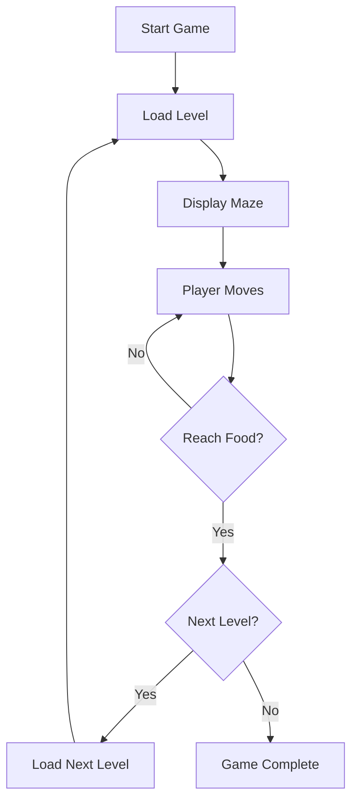

## 1. Product Overview
一个基于Web的迷宫游戏，玩家控制角色在迷宫中寻找食物终点。游戏包含多个关卡，难度递增，提供趣味性和挑战性。

## 2. Core Features

### 2.1 User Roles
| Role | Registration Method | Core Permissions |
|------|---------------------|------------------|
| Player | None | Play game, navigate maze, complete levels |

### 2.2 Feature Module
1. **Game Page**: Main game area with maze, player character, food target, controls
2. **Level System**: Multiple levels with increasing difficulty
3. **Game Controls**: Keyboard (WASD/Arrow keys) and touch controls

### 2.3 Page Details
| Page Name | Module Name | Feature description |
|-----------|-------------|---------------------|
| Game Page | Maze Display | Render maze with walls, paths, player and food |
| Game Page | Player Movement | Smooth movement controlled by keyboard/touch |
| Game Page | Level System | 5+ levels, increasing maze size and complexity |
| Game Page | Win Detection | Detect when player reaches food, move to next level |
| Game Page | UI Interface | Show current level, timer, controls |

## 3. Core Process
玩家进入游戏 -> 选择开始 -> 在迷宫中移动角色 -> 到达食物终点 -> 进入下一关 -> 完成所有关卡获得胜利

## 4. User Interface Design

### 4.1 Design Style
- **Color Scheme**: Dark theme with neon accents (#0f172a dark background, #10b981 green for paths, #ef4444 red for walls, #fbbf24 gold for food)
- **Font**: Pixel-style font for retro gaming feel
- **Layout**: Centered game area with HUD overlay
- **Animation**: Smooth movement transitions, level completion celebration effects

### 4.2 Page Design Overview
| Page Name | Module Name | UI Elements |
|-----------|-------------|-------------|
| Game Page | Maze | Grid-based maze with wall textures |
| Game Page | Player | Character image (player.png) |
| Game Page | Food | Target image (food.png) |
| Game Page | HUD | Level indicator, timer, controls hint |
| Game Page | Controls | On-screen directional buttons for mobile |

### 4.3 Responsiveness
- Desktop: Keyboard controls, mouse hover effects
- Mobile: Touch controls, responsive maze size

### 4.4 Technical Notes
- Player image: player.png (provided)
- Food image: food.png (provided)
- Maze generation: Recursive backtracking algorithm
- Level progression: Increasing grid size (10x10 -> 15x15 -> 20x20 -> 25x25 -> 30x30)
