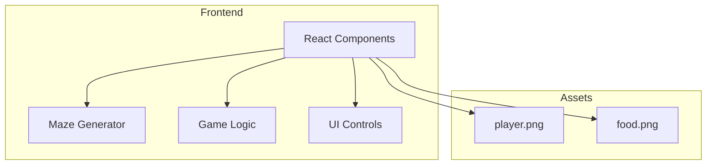

## 1. Architecture Design


## 2. Technology Description
- Frontend: React@18 + TypeScript + tailwindcss@3 + vite
- Initialization Tool: vite-init
- Backend: None (pure frontend game)
- Database: None

## 3. Route Definitions
| Route | Purpose |
|-------|---------|
| / | Main game page |

## 4. Component Structure
```
src/
├── components/
│   ├── Maze.tsx          # Maze rendering component
│   ├── Player.tsx        # Player character component
│   ├── Food.tsx          # Food target component
│   ├── GameControls.tsx  # Touch controls for mobile
│   └── HUD.tsx           # Heads-up display
├── hooks/
│   ├── useGame.ts        # Game state management
│   └── useKeyboard.ts    # Keyboard input handling
├── utils/
│   ├── mazeGenerator.ts  # Maze generation algorithm
│   └── levelConfig.ts    # Level configurations
├── App.tsx
└── main.tsx
```

## 5. Data Models

### 5.1 Maze Cell
```typescript
interface Cell {
  x: number;
  y: number;
  walls: {
    top: boolean;
    right: boolean;
    bottom: boolean;
    left: boolean;
  };
  visited: boolean;
}
```

### 5.2 Game State
```typescript
interface GameState {
  level: number;
  playerPosition: { x: number; y: number };
  foodPosition: { x: number; y: number };
  maze: Cell[][];
  isPlaying: boolean;
  isCompleted: boolean;
  timer: number;
}
```

### 5.3 Level Configuration
```typescript
interface LevelConfig {
  level: number;
  gridSize: number;
  cellSize: number;
  description: string;
}
```

## 6. Level Progression
| Level | Grid Size | Cell Size | Difficulty |
|-------|-----------|-----------|------------|
| 1 | 10x10 | 40px | Easy |
| 2 | 13x13 | 35px | Medium |
| 3 | 16x16 | 30px | Hard |
| 4 | 19x19 | 28px | Very Hard |
| 5 | 22x22 | 25px | Expert |

## 7. Controls
- **Desktop**: Arrow keys or WASD for movement
- **Mobile**: On-screen directional buttons
- **Touch**: Swipe gestures for movement

## 8. Game Logic
1. Generate maze using recursive backtracking algorithm
2. Place player at start (top-left)
3. Place food at end (bottom-right)
4. Handle player movement with collision detection
5. Check win condition when player reaches food
6. Progress to next level or show completion screen
